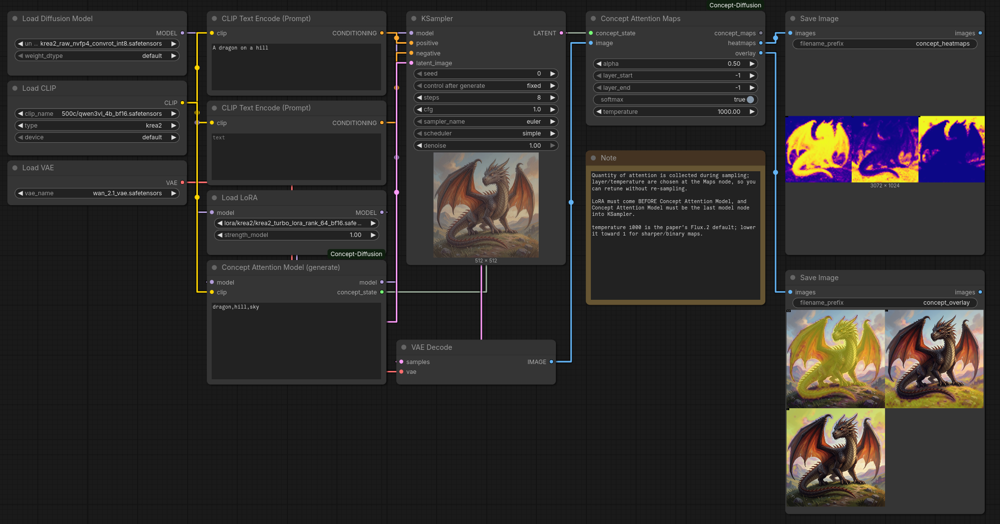

# ComfyUI-Concept-Diffusion

Per-concept saliency maps for diffusion transformers, from
[ConceptAttention](https://arxiv.org/abs/2502.04320). Works with nvfp4 and
int8-convrot models.

## Supported models

| Model | Text encoder | VAE |
|-------|--------------|-----|
| Krea 2 | Qwen3-VL-4B (`krea2`) | Wan 2.1 |
| Flux.2 Klein / Flux.2 | Qwen3-4B/8B (`flux2`) | Flux.2 |

## Install

Copy this folder into `ComfyUI/custom_nodes/` and restart ComfyUI.

## Nodes

| Node | Inputs | Outputs |
|------|--------|---------|
| Concept Attention Model | `MODEL`, `CLIP`, `concepts` | `MODEL`, `concept_state` |
| Concept Attention Maps | `concept_state`, `IMAGE` | `concept_maps`, `heatmaps`, `overlay` |
| Concept Attention (encode image) | `MODEL`, `VAE`, `CLIP`, `IMAGE`, `prompt`, `concepts` | `concept_maps`, `heatmaps`, `overlay` |
| Concept Attention Visualizer | `concept_maps`, `IMAGE` | `overlay` |
| Concept Saliency Map | `concept_maps` | `MASK`, `saliency` |

## Usage

**Generate** — collect concept attention while sampling:

1. Add `Concept Attention Model` after all LoRA/loader nodes and before `KSampler`.
2. Connect its `concept_state` and the decoded image to `Concept Attention Maps`.
3. Save `heatmaps` (one labeled panel per concept) and `overlay` (one labeled overlay image per concept).

**Encode an existing image** — one node:

1. Connect image, model, VAE, CLIP, prompt and concepts to `Concept Attention (encode image)`.
2. Save `heatmaps` (one labeled panel per concept) and `overlay` (one labeled overlay image per concept).

## Settings

| Setting | Default | Notes |
|---------|---------|-------|
| `concepts` | — | Comma separated. Use words that appear in the prompt. |
| `temperature` | `1000` | Lower for sharper maps, raise for smoother. |
| `layer_start` / `layer_end` | `-1` | `-1` = the last 4 transformer blocks. |
| `softmax` | `true` | Normalize across concepts per pixel. |
| `noise_timestep` / `num_steps` | `2` / `4` | Encode mode only. |
| `alpha` | `0.5` | Overlay opacity. |

## Example workflows

In [`example_workflows/`](example_workflows):

| File | Description |
|------|-------------|
| `generate_krea2.json` | Krea 2, generate + capture (UI) |
| `generate_krea2_api.json` | Same graph, API format |
| `encode_image.json` | Attribute an existing image (UI) |

## License

MIT — see [LICENSE](LICENSE). Original work © 2025 Junst; rewrite © 2026 rockerBOO.
